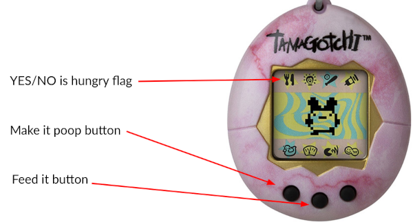
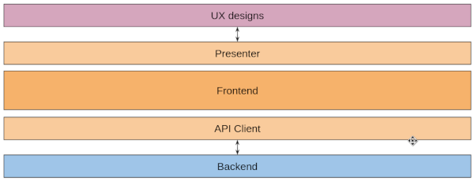

Tamagotchi TDD Workshop - frontend
==================================

The crazy mates from Product team asked to make a Tamagotchi web application, 
unbelievable...

They want a realistic interface with interactive buttons and scores like the 
following schematic approach.



## Main product requirements ##

* Web based interface.
* Every user a different Tamagotchi state.

## Team responsibilities ##

According to these requirements, Tech Lead and Architect decide to 
distribute the tasks between UX, Frontend and Backend teams.

The UX Team started working on the design and layout pieces. They are providing
every text, image in the specific size, fonts, etc.

Backend fellas are talking in their alien language about domain, infrastructure
and a lot of weird words that after many years trying to understand they cannot 
totally comprehend yet. Anyway, Backend is handling the Tamagotchi state, 
hungriness, happiness,... and behaviour.

Frontend developers... We are in the middle of both teams above. We are 
assembling the UX Team stuff, listening to the user events, informing Backend
API about them, and converting the API response into a visual and easy 
information to make the silliest mind in this world understand. User having 
brain is a utopia.

## Frontend architecture approach ##

We deal with UX requirements and with Backend endpoints. We want to live in 
peace with them, they have to define and describe us how the material and
services respectively work. They are our vendors. We are meeting the UX 
requirements with a Presenter service and by the other hand we are talking with
Backend API with an API client.



## TDD key points ##

* Little step makes getting back easier.
* Making every new scenario fail tests that failing also works (mutant testing).
* Do not include external resources in unit tests. Minimum resources.
* Finely choose descriptive words for the instances, classes and members.
* Do not develop what you do not need yet.

## Workshop step by step ##

### Test List ###

Create a test list. For example:

* Ask whether a Tamagotchi is hungry.
* Feed a Tamagotchi.
* Make a Tamagotchi poop.

#### Init project ####

Create a new project.

```
mkdir /path/to/kata-tdd-tamagotchi-frontend
cd /path/to/kata-tdd-tamagotchi-frontend
npm init
npm install --save-dev mocha sinon assert
mkdir -p test/unit src
tree -I node_modules
```

You will put every unit test file in [test/unit](test/unit), then the test 
script command in package.json will be `mocha test/unit`.

```
{
  ...
  "scripts": {
    "test": "mocha test/unit"
  },
   ...
  }
}
```

### Test rounds ###

1. Start creating the first test unit module for the first scenario of the 
   first test list item. 
2. Make it fail (red). 
3. Make it work (green). 
4. Improve it (refactor).
5. Create next test scenario.
6. Got to point 2 (red again) and so on.

Create all scenarios for your test list.

Example unit tests at [test/unit](test/unit) directory.

## All unit tests are done, asynchronous what? ##

We finished all required behavior unit test scenarios and right now we realized
that the API client and the Presenter, actually they are asynchronous jobs.

Indeed, it doesn't matter. Backend team has not provided the final 
infrastructure yet, so we are going to make fake asynchronous API endpoints 
based on file system. For example, the endpoint for asking whether Tamagotchi is
hungry is a file with the following content:

```json
{
   "hungry":  true
}
```

The changes involve the new integration tests and also a change in the core.
The application services, like for "asking whether a Tamagotchi is hungry", they
aren't asynchronous. Move it on, it's very easy.

Add a new npm command in package.json to execute all tests, unit and integration 
ones.

```
{
  ...
  "scripts": {
    "fulltest": "mocha test/unit test/integration",
    "test": "mocha test/unit"
  },
   ...
  }
}
```

Example test scenario at
[test/integration/askwhetheritishungry.spec.js](test/integration/askwhetheritishungry.spec.js)

## Now what, Gatsby!? ##

That m____r f____r! What she had in mind!? bull___t! or... no, wait. Don't
panic, my friend. You are doing well, you developed the core of the Frontend,
even a fake API Client that you easily replaced and tested for a real one when 
Backend will provide their infrastructure. 

Now the Tech Lead decided to wrap it up into a Gatsby framework because it's
a very critical infrastructure requirement, ok, it's just an integration of the 
Presenter.

Let's do it!

## Ok the story is over ##

I hope you followed and enjoyed this workshop as I did. Please, do pull requests
if you want to collaborate in this repository with your incredible helpful 
point of view.

## Example source code ##

The point is to begin the workshop from scratch, the example source code here is
just a reference for an eventually lost workshop leader.

Installing and running the unit test scenarios only as follows:

```
npm install
npm test
```
Running all test scenarios, unit and integration ones as follows:

```
npm run fulltests
```

## Workshop material ##

Workshop slides here:
https://docs.google.com/presentation/d/1e8D21sHkyLx16kdjPDyO2Da5D0mZqM3ynWyrnmS9knM/edit?usp=sharing

## Author ##

Jaume Mila Bea <jmila@ext.leadtech.com>
